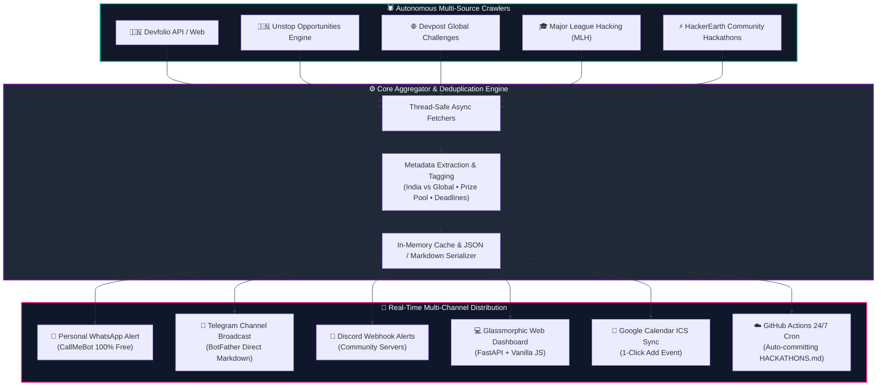

<div align="center">

```
  ██╗  ██╗ █████╗  ██████╗██╗  ██╗ █████╗ ████████╗██╗  ██╗ ██████╗ ███╗   ██╗
  ██║  ██║██╔══██╗██╔════╝██║ ██╔╝██╔══██╗╚══██╔══╝██║  ██║██╔═══██╗████╗  ██║
  ███████║███████║██║     █████═╝ ███████║   ██║   ███████║██║   ██║██╔██╗ ██║
  ██╔══██║██╔══██║██║     ██╔═██╗ ██╔══██║   ██║   ██╔══██║██║   ██║██║╚██╗██║
  ██║  ██║██║  ██║╚██████╗██║ ╚██╗██║  ██║   ██║   ██║  ██║╚██████╔╝██║ ╚████║
  ╚═╝  ╚═╝╚═╝  ╚═╝ ╚═════╝╚═╝  ╚═╝╚═╝  ╚═╝   ╚═╝   ╚═╝  ╚═╝ ╚═════╝ ╚═╝  ╚═══╝
              ██╗  ██╗██╗   ██╗███╗   ██╗████████╗███████╗██████╗             
              ██║  ██║██║   ██║████╗  ██║╚══██╔══╝██╔════╝██╔══██╗            
              ███████║██║   ██║██╔██╗ ██║   ██║   █████╗  ██████╔╝            
              ██╔══██║██║   ██║██║╚██╗██║   ██║   ██╔══╝  ██╔══██╗            
              ██║  ██║╚██████╔╝██║ ╚████║   ██║   ███████╗██║  ██║            
              ╚═╝  ╚═╝ ╚═════╝ ╚═╝  ╚═══╝   ╚═╝   ╚══════╝╚═╝  ╚═╝            
```

# ⚡ HACKATHON HUNTER ⚡
### 🏆 *The Ultimate Zero-Cost Intelligence Sniper for Hackers & Builders*

<p align="center">
  <a href="https://git.io/typing-svg">
    
  </a>
</p>

---

<!-- BADGES SHIELD ROW -->
<p align="center">
  
  
  
  
  
  
  
</p>

<p align="center">
  <a href="#-architecture--flow-diagram"><b>Architecture</b></a> •
  <a href="#-features-that-hit-different"><b>Features</b></a> •
  <a href="#-supported-platforms"><b>Platforms</b></a> •
  <a href="#-quickstart-2-minutes"><b>Quickstart</b></a> •
  <a href="#-cli-superpowers"><b>CLI Bot</b></a> •
  <a href="#-glassmorphic-web-dashboard"><b>Web App</b></a> •
  <a href="#-247-cloud-automation"><b>Cloud Cron</b></a>
</p>

</div>

---

## 💥 What is Hackathon Hunter?

> **Hackathon Hunter** is an autonomous, high-speed intelligence engine engineered for developers, competitive hackers, and students across **India 🇮🇳 & Worldwide 🌐**. 
> 
> It crawls, scrapes, deduplicates, and normalizes hackathon data from **5+ premier platforms** without requiring expensive APIs or server subscriptions. Get notified straight to your **WhatsApp**, broadcast to your **Telegram channel**, or explore via a sleek **Glassmorphic Dark-Mode UI**.

```
    ┌─────────────────────────────────────────────────────────────┐
    │  🔥 0 Paid APIs  •  ⚡ Multi-threaded  •  📱 Dual Alerts     │
    │  🌐 100% Free GitHub Actions Cron  •  📅 Google Cal Sync   │
    └─────────────────────────────────────────────────────────────┘
```

---

## 🔮 Architecture & Flow Diagram

Here is how Hackathon Hunter orchestrates parallel scrapers, parses live data, and routes digests to your devices:



---

## ⚡ Features That Hit Different

<table>
  <tr>
    <td width="50%">
      <h3>🎯 100% Free & Zero-API Setup</h3>
      <p>No paid RapidAPI keys, no OpenAI credit drain, no proxies needed. Built using clean, pure HTTP endpoints, RSS feeds, and official public APIs.</p>
    </td>
    <td width="50%">
      <h3>📱 WhatsApp & Telegram Push</h3>
      <p>Wake up to a curated morning briefing at <b>8:00 AM IST</b> delivered right into your personal WhatsApp chat and shared with your hacker squad on Telegram.</p>
    </td>
  </tr>
  <tr>
    <td width="50%">
      <h3>🌐 India 🇮🇳 & Global 🌍 Smart Filtering</h3>
      <p>Instant tagging for college fests in Bengaluru, Delhi, Mumbai, or fully remote global bounties in USD / EUR with top tier prize pools.</p>
    </td>
    <td width="50%">
      <h3>📅 1-Click Google Calendar Sync</h3>
      <p>Never miss a submission deadline! Export any hackathon directly to Google Calendar or download universal <code>.ics</code> files.</p>
    </td>
  </tr>
  <tr>
    <td width="50%">
      <h3>💻 Cyberpunk Glassmorphic UI</h3>
      <p>Dark-mode dashboard with instant search, platform chips, 1-click URL copy, live prize pool badges, and responsive mobile-first layouts.</p>
    </td>
    <td width="50%">
      <h3>☁️ Autonomous 24/7 GitHub Actions</h3>
      <p>Runs automatically in the cloud with zero server hosting bills. Auto-updates <a href="HACKATHONS.md"><code>HACKATHONS.md</code></a> on every run.</p>
    </td>
  </tr>
</table>

---

## 🌐 Supported Platforms

| Platform | Type | Target Region | Free Tier Status | Live Links |
| :--- | :---: | :---: | :---: | :---: |
|  | Webhook / JSON | 🇮🇳 India & Global | 🟢 100% Free | [Browse Devfolio](https://devfolio.co/hackathons) |
|  | Public REST API | 🇮🇳 College & Corporate | 🟢 100% Free | [Browse Unstop](https://unstop.com/hackathons) |
|  | Scraper & Feed | 🌐 Worldwide Online | 🟢 100% Free | [Browse Devpost](https://devpost.com/hackathons) |
|  | Event Scraper | 🌐 Global Student Circuit | 🟢 100% Free | [Browse MLH](https://mlh.io/seasons/2025/events) |
|  | Public Challenges | 🇮🇳 India & Online | 🟢 100% Free | [Browse HackerEarth](https://www.hackerearth.com/challenges/) |

---

## 🚀 Quickstart (2 Minutes)

### 1️⃣ Clone & Install

```bash
# Clone the repository
git clone https://github.com/stefinmathew66-lab/hackathon.git
cd hackathon

# Create and activate virtual environment
python3 -m venv venv
source venv/bin/activate   # On Windows: venv\Scripts\activate

# Install requirements
pip install -r requirements.txt
```

### 2️⃣ Configure Environment Variables

```bash
cp .env.example .env
```

Edit `.env` with your notification keys (all free!):

```env
# Personal WhatsApp Alerts (via CallMeBot - 100% Free)
WHATSAPP_PHONE=+919876543210
WHATSAPP_APIKEY=your_callmebot_api_key

# Telegram Channel / Group Broadcast
TELEGRAM_BOT_TOKEN=123456789:ABCdefGhIJKlmNoPQRsTUVwxyZ
TELEGRAM_CHAT_ID=@your_channel_username
```

> 💡 **WhatsApp Key in 10 seconds:** Add `+34 644 44 49 97` to WhatsApp and send: `I allow callmebot to send me messages`.
>
> 💡 **Telegram Bot in 30 seconds:** Message `@BotFather` on Telegram -> `/newbot` -> copy token and add bot as Admin in your channel.

---

## 🤖 CLI Superpowers

Hackathon Hunter comes loaded with a hacker-friendly interactive CLI:

```bash
# 🎮 Launch the interactive cyberpunk menu
python bot.py -i
```

```
 ╔═════════════════════════════════════════════════════════════════════╗
 ║              🚀 HACKATHON HUNTER — INTERACTIVE CLI 🚀              ║
 ╚═════════════════════════════════════════════════════════════════════╝
  [1] 📋 View Top Upcoming Hackathons
  [2] 🇮🇳 Filter India Only
  [3] 🌐 Filter Global Online Only
  [4] 🔍 Search by Keyword (e.g. AI, Web3, FinTech)
  [5] 📱 Send WhatsApp Alert Now
  [6] 📢 Broadcast to Telegram Channel
  [7] 💾 Export to HACKATHONS.md & JSON
  [8] 🚪 Exit
```

### One-Liner Shortcuts:
```bash
# Filter India events only
python bot.py --india

# Filter Online hackathons only
python bot.py --online

# Search specific domains
python bot.py --search "GenAI"

# Trigger WhatsApp Notification
python bot.py --notify-whatsapp

# Broadcast to Telegram Channel
python bot.py --notify-telegram

# Blast to all configured channels at once
python bot.py --notify-all
```

---

## 💻 Glassmorphic Web Dashboard

Launch the local FastAPI-powered web UI with hot-reloading:

```bash
python app.py
```
👉 Open your browser at **[http://localhost:8000](http://localhost:8000)**

<div align="center">
  
  
  
</div>

### ✨ Web App Highlights:
- 🎨 **Sleek Cyber Glass Aesthetics**: Fluid dark mode with neon glow effects.
- ⚡ **Instant Filters**: Filter by platform (Devfolio, Unstop, Devpost, etc.), location (India vs Global), or tags (AI, Web3, Open Source).
- 🔗 **1-Click Apply & Copy**: Jump directly to registration pages or copy shareable link cards.
- 📅 **Google Calendar Integration**: Add submission deadlines straight into your Google Calendar in 1 click.

---

## ☁️ 24/7 Cloud Automation (GitHub Actions)

Zero servers. Zero monthly payments.

The automated workflow [`.github/workflows/hackathon_bot.yml`](.github/workflows/hackathon_bot.yml) runs every morning at **08:00 AM IST (02:30 UTC)**:

1. Goes to repository **Settings ➔ Secrets and variables ➔ Actions**.
2. Adds your secrets:
   - `WHATSAPP_PHONE`
   - `WHATSAPP_APIKEY`
   - `TELEGRAM_BOT_TOKEN`
   - `TELEGRAM_CHAT_ID`
3. **Sit back and relax!** Every morning:
   - 📲 Your personal WhatsApp receives the daily top hackathon digest.
   - 📢 Your Telegram channel is updated automatically.
   - 📄 [`HACKATHONS.md`](HACKATHONS.md) is refreshed with live markdown tables and committed back to the repo.

---

## 🗺️ Roadmap & Hackathon Trophy Milestones

- [x] Multi-source scrapers (Devfolio, Unstop, Devpost, MLH, HackerEarth)
- [x] Zero-cost personal WhatsApp integration via CallMeBot
- [x] Telegram channel automated rich broadcast
- [x] GitHub Actions automated daily cron workflow
- [x] Glassmorphic responsive dark web dashboard
- [x] Google Calendar `.ics` generation
- [ ] 🤖 AI-powered resume & skill match for hackathons
- [ ] 💰 Live cash prize pool currency converter ($ USD to ₹ INR)
- [ ] 👥 Hacker squad teammate finder Discord bot

---

## 🤝 Contributing & Hackathon Spirit

Got an idea or want to add another platform scraper (e.g. Kaggle, DoraHacks, Gitcoin)?

1. **Fork** the repository
2. **Create your feature branch**: `git checkout -b feature/epic-scraper`
3. **Commit your changes**: `git commit -m '⚡ Add DoraHacks Scraper'`
4. **Push to the branch**: `git push origin feature/epic-scraper`
5. **Open a Pull Request** 🚀

<div align="center">

### ⭐ Star this repo if it helps you win your next hackathon! ⭐

**HUNT. BUILD. WIN. REPEAT.** 🏆

</div>
